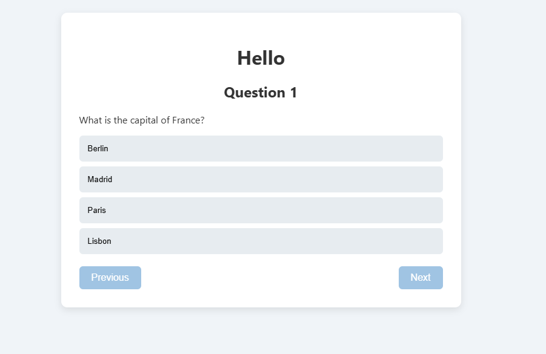
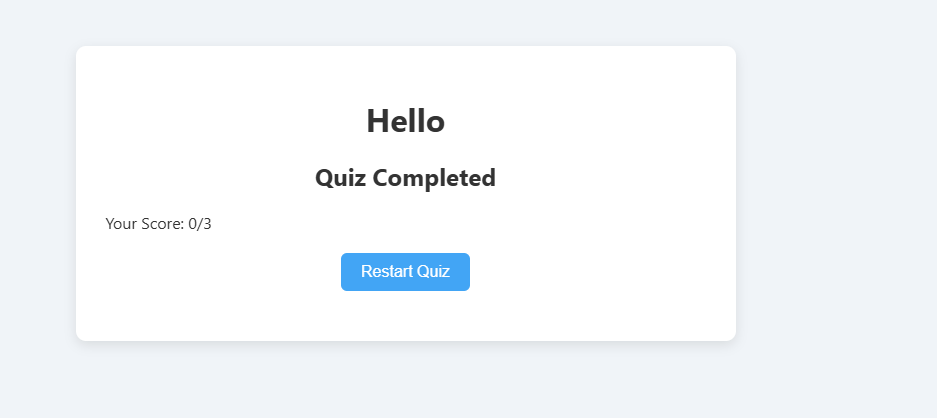

# Quiz App

A simple and interactive Quiz App built with **React** and **Vite**. This project is part of a refresher course and demonstrates how to build a lightweight and fast front-end app.

---

## 🚀 Features
- React components with hooks
- Fast build and hot reload using Vite
- ESLint integrated for code quality
- Simple and extendable structure
- Track and display quiz scores

---

## 🛠️ Tech Stack
- [React](https://reactjs.org/)
- [Vite](https://vitejs.dev/)
- [ESLint](https://eslint.org/)
- JavaScript, HTML, CSS

---

## 📸 Screenshots

Here’s a preview of the app:

<p align="center">
  
  &nbsp;
  
</p>

*(Add more screenshots in the `screenShots/` folder and update the paths here as needed.)*

---

## 📦 Installation

Clone the repository:

```bash
git clone https://github.com/petermagalong/QUIZ-APP.git
cd QUIZ-APP
